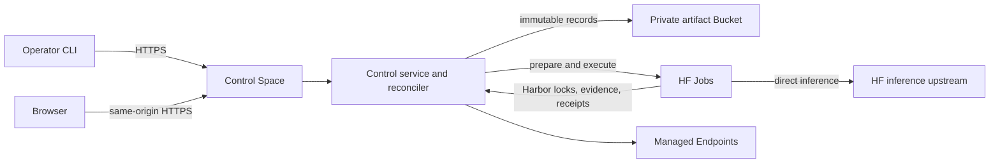

<p align="center">
  
</p>

`harbor-hf` is a hosted control plane for running Harbor benchmarks on Hugging
Face infrastructure. It resolves approved profiles, asks Harbor to prepare and
execute exact trials in HF Jobs, keeps immutable evidence in a private HF
Bucket, and publishes queryable results. The operator machine does not run the
benchmark or load the model.

## How it works

A hosted installation has two persistent resources:

- one application-protected control Space; and
- one private artifact Bucket.

The Space runs the API, web console, reconciler, and a disposable SQLite
projection. The Bucket is durable truth.



Harbor is the execution authority. It resolves benchmark sources, loads the
selected agent, runs each task environment, invokes the verifier, and writes
the native trial result. Harbor-HF owns profile composition, Run and physical
attempt identity, HF resource lifecycle, admission, retries, evidence
acceptance, cleanup, and publication.

### Direct inference

For an inference-backed execution, the model, harness, and deployment profiles
resolve to one immutable Harbor `AgentConfig`:

- `model_name` is the canonical Harbor model route;
- `env` supplies the approved upstream URL, the Job-provided inference
  credential, and locked runtime settings;
- `extra_allowed_hosts` contains the upstream host; and
- the model and harness must both support the deployment's declared API.

The Harbor agent calls that upstream directly. Harbor-HF adds no intermediate
transport layer and does not translate between Chat Completions and Responses.
The native Harbor result, required session or trajectory, workspace evidence,
verifier output, and infrastructure receipts remain authoritative.

Preparation Jobs receive no inference credential. An execution Job receives
`HF_INFERENCE_TOKEN` only when its resolved deployment has an inference
upstream. Harbor expands the credential reference in `AgentConfig.env` for the
agent that needs it. The control credential never enters a Job.

## Local tools

Harbor-HF has two local command-line surfaces:

- `npm run install:*` operates the repository-local TypeScript installer. It
  plans, provisions, configures, verifies, activates, or disables the hosted
  Space and Bucket through the authenticated Hugging Face CLI.
- `harbor-hf` is the Python operator CLI. It is a thin HTTPS client for the
  control API; it does not read the Bucket, call HF lifecycle APIs, execute
  Harbor, or reconcile Runs locally.

A mutating CLI command submits one confirmed request and exits after durable
intent is recorded. The hosted service continues preparation, execution,
observation, cleanup, and publication asynchronously. Preserve the
`--idempotency-key` used for submission. After an ambiguous response, inspect
Run and audit state rather than submitting again.

## Install the hosted service

### Prerequisites

1. Clone the exact source and run `npm ci`.
2. Use Node.js `>=22.12.0` on Linux with `flock`.
3. Install Hugging Face CLI `>=1.23.0 <2.0.0` and authenticate it as the
   approved installer identity.
4. Select the exact `<namespace>/<control-space>` and private
   `<namespace>/<artifact-bucket>`.
5. Obtain authorization before provisioning, configuring credentials,
   activating writes, changing hardware, or making any other remote mutation.
6. Prepare distinct narrowly scoped credentials for control operations and
   inference.

The installer keeps owner-only plans, release bundles, locks, and receipts
outside the checkout. Reuse the same `--state-dir` throughout an installation.
Do not delete or replace live installer state to bypass a mismatch.

### Plan

```bash
npm run install:plan -- --space '<namespace>/<control-space>'
```

Planning inspects the local revision, release bundle, authenticated CLI
identity, and existing target resources. It does not mutate remote state.
Review the exact Space, Bucket, access mode, hardware, disabled write mode, and
proposed action.

### Provision

```bash
npm run install:provision -- --space '<namespace>/<control-space>'
```

For a new installation this creates only the protected Space and private
Bucket in their safe initial state and records an owner-only resource receipt.
It does not upload source or request credential values.

### Configure

```bash
npm run install:configure -- --space '<namespace>/<control-space>'
```

Configuration revalidates the saved plan and resource receipt, uploads the
exact release, verifies the observed source revision, checks the proposed
credentials' required scopes, stores `HF_TOKEN` and `HF_INFERENCE_TOKEN` as
Space secrets, and leaves writes disabled. Credential values may come from the
installer-only `HARBOR_HF_INSTALL_CONTROL_SECRET` and
`HARBOR_HF_INSTALL_INFERENCE_SECRET` process variables or hidden terminal
prompts. Never place values in arguments, repository files, logs, plans, or
receipts.

### Verify and activate

```bash
npm run install:verify -- --space '<namespace>/<control-space>'
npm run install:activate -- --space '<namespace>/<control-space>' --mode canary
```

Verification is non-mutating and checks source, variables, secret names,
hardware, application protection, health, and write mode. Inspect the service
before activation. Production activation and paid hardware require their own
explicit approval and evidence gates. Use `install:disable` for the supported
emergency write-disable transition.

Detailed installer behavior and stop conditions are in
[the control-service specification](docs/CONTROL_SERVICE.md).

## Install and authenticate the operator CLI

```bash
uv tool install .
export HARBOR_HF_CONTROL_URL=https://<control-space>.hf.space
export HARBOR_HF_CONTROL_BEARER_TOKEN=<approved-control-bearer>
harbor-hf status
```

Use a purpose-scoped bearer approved for this service. Do not substitute a
personal account credential, print the value, or store it in shell history or
repository files. Browser access uses Hugging Face OAuth and same-origin API
requests.

## Agent Workbench

The authenticated [Agent Workbench](docs/agent-workbench.md) compiles generic
command-agent recipes, previews typed environment expansion, and tests setup in
a disposable local Docker container or HF Job. Workbench setup state is
ephemeral. Only an exact recipe matching a reviewed immutable harness profile
and compatible deployment can continue to the normal Run launcher.

## Start a Run

Inspect the service and promoted profiles:

```bash
harbor-hf status
harbor-hf profiles
harbor-hf capacity
```

Then submit one immutable Run:

```bash
harbor-hf run submit \
  --benchmark <benchmark-profile> \
  --model <model-profile> \
  --harness <harness-profile> \
  --deployment <deployment-profile> \
  --launch-policy <launch-policy-profile> \
  --ceiling-microusd <approved-ceiling> \
  --idempotency-key <stable-request-key> \
  --yes
```

The service resolves aliases once and stores the exact profile records and
execution contract. A credential-free preparation Job uses the pinned Harbor
revision to produce the ordered `JobLock` and one prepared trial record per
logical task. Execution Jobs reconstruct those prepared trials rather than
resolving the benchmark again.

Each physical execution Job:

1. validates its Run, launch action, task assignment, and signed capability;
2. fetches the exact prepared trial and locked task image;
3. runs Harbor with the resolved `AgentConfig`;
4. freezes the post-agent workspace before verification;
5. accepts Harbor's verifier result only when the emitted lock matches the
   prepared lock;
6. uploads content-addressed evidence and a canonical manifest; and
7. submits a terminal receipt to the control API.

## Monitor, cancel, and repair

```bash
harbor-hf run status <run-id>
harbor-hf jobs
harbor-hf endpoints
harbor-hf results
harbor-hf audit
```

Job logs are diagnostic, not authoritative. A valid result needs a selected
attempt receipt, verified evidence digest, and terminal logical outcome in the
Bucket-backed projection.

Cancellation is durable intent. Continue monitoring until active work drains,
owned Endpoints are paused with zero ready replicas, and cleanup evidence is
recorded.

Only typed, replacement-eligible infrastructure failures may receive another
physical attempt:

```bash
harbor-hf run retry-infrastructure <run-id> \
  --task <task-id> \
  --reason "<infrastructure reason>" \
  --yes
```

Semantic model outcomes, benchmark timeouts, refusals, verifier failures, and
valid zero scores are terminal. Publication recovery never reruns inference.

## Safety and evidence

- `HF_TOKEN` stays in the control Space and is never sent to a Job.
- `HF_INFERENCE_TOKEN` is sent only to an execution Job whose immutable
  deployment resolves an inference upstream.
- Jobs never receive a writable mount of the canonical Bucket.
- Workers use short-lived signed capabilities limited to one Run, launch
  action, task set, operation set, and expiration.
- Model routes, API compatibility, upstream hosts, output limits, timeouts,
  prices, hardware, images, and source revisions are immutable profile data.
- Known credentials and high-confidence credential patterns are scanned in
  evidence paths and bytes before acceptance or publication.
- Managed Endpoints must be observed paused with zero ready replicas before an
  endpoint-backed Run can complete.
- SQLite is disposable. Replaying immutable Bucket records must reconstruct
  the same control state and next action.

See:

- [Architecture](docs/architecture.md)
- [Control service](docs/CONTROL_SERVICE.md)
- [Harbor compatibility contract](docs/harbor-integration-contract.md)
- [Harbor agent architecture](docs/provider-agent-architecture.md)
- [Hosted operations cookbook](docs/harbor-cookbook.md)

## Development

Use Node.js `>=22.12.0`, the root npm lockfile, strict TypeScript, Biome,
Vitest, and Playwright for the control service and web application. Use Python
3.12+, uv, Ruff, ty, and pytest for the CLI and remote workers. Versioned JSON
Schema is authoritative for durable records; generated TypeScript contracts
must stay synchronized.

Run the checks relevant to the files changed. Do not run local model inference.
Remote integration tests must be explicitly authorized and must leave every
managed Endpoint paused.

Repository-wide implementation and authorization rules are in
[AGENTS.md](AGENTS.md).

## License

Apache-2.0. See [LICENSE](LICENSE).
